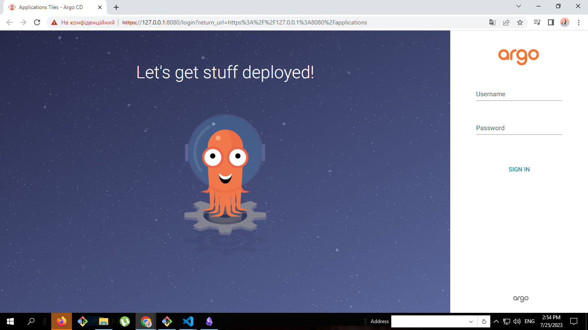
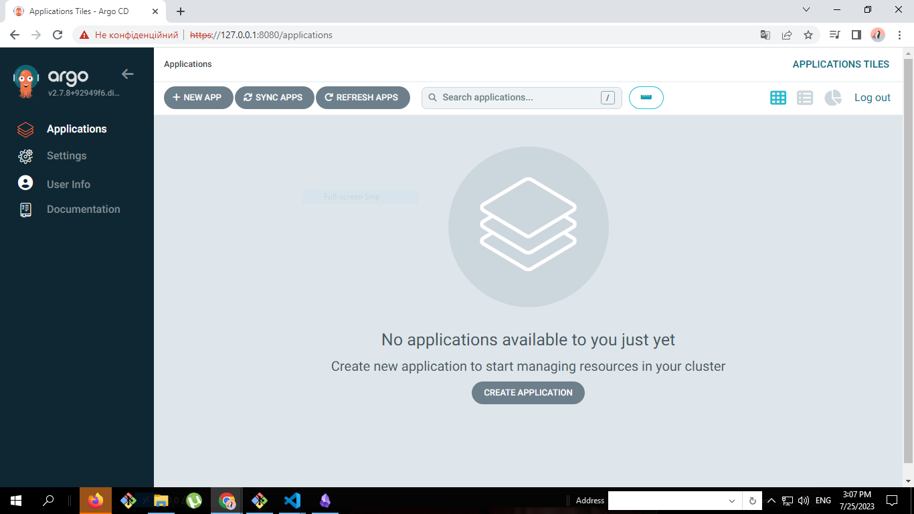

# Deployment ArgoCD into Kubernetes Cluster k3d


1.1 Create a k3d cluster by running the following command:
   
   ```
   k3d cluster create my-cluster
   ```

1.2 Сreate AgroCD namespace 'argocd':

   ```
   kubectl create namespace argocd
   kubectl apply -n argocd -f https://raw.githubusercontent.com/argoproj/argo-cd/stable/manifests/install.yaml
   ```

1.3 To access the ArgoCD web interface, use Port Forwarding:

   ```
   kubectl port-forward svc/argocd-server -n argocd 8080:443
   ```

1.4 Open a web browser and login to `https://localhost:8080` with admin and password, using following command




1.5 Get admin password using following command:
   ```
   kubectl -n argocd get secret argocd-initial-admin-secret -o jsonpath="{.data.password}" | base64 -d; echo
   ```

1.6. Login to with admin and password with previous step

